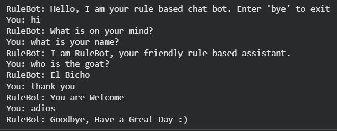

# Rule-Based Chatbot (RuleBot)



A lightweight, interactive command-line chatbot built in Python. This project demonstrates basic Natural Language Processing (NLP) concepts using rule-based pattern matching and input sanitization.

## Features
* **Pattern Matching:** Matches user inputs against predefined keywords.
* **Input Sanitization:** Automatically handles trailing spaces and letter casing (e.g., "Hello " or "HELLO" will both work).
* **Graceful Exit:** Recognizes multiple exit commands like `bye`, `exit`, `quit`, and `adios`.
* **Fallback System:** Gently guides users back on track if they enter an unrecognized command.

## Tech Stack
* **Language:** Python 3.x

## How to Run

1. Make sure you have Python installed on your computer.
2. Clone this repository or download the `chatbot.py` file.
3. Open your terminal or command prompt, navigate to the folder containing the file, and run:
   ```bash
   python chatbot.py
